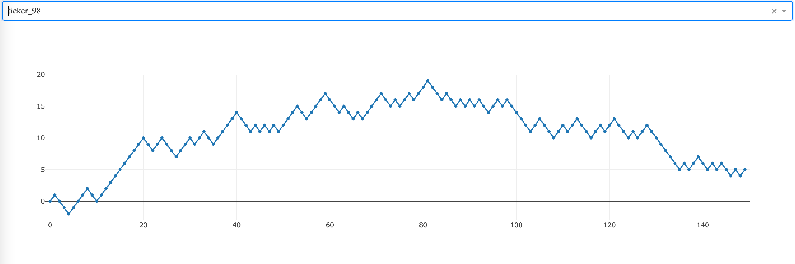

# Fake Stock Data Chart

Some dashboard showing synthetic stock data generated by a separate process based on randomness. There is a choice of 100 tickets, each of it is expanding with real-time data

Pet project for the study of new technologies:
- dash
- plotly
- SQLAlchemy
- alembic
- pydantic

### Running

exec `docker-compose up` and open `http://0.0.0.0:8050/`

